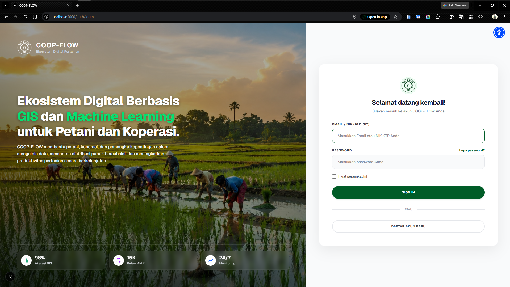
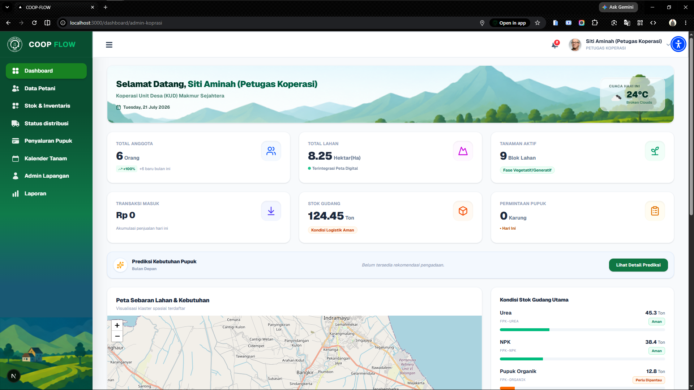
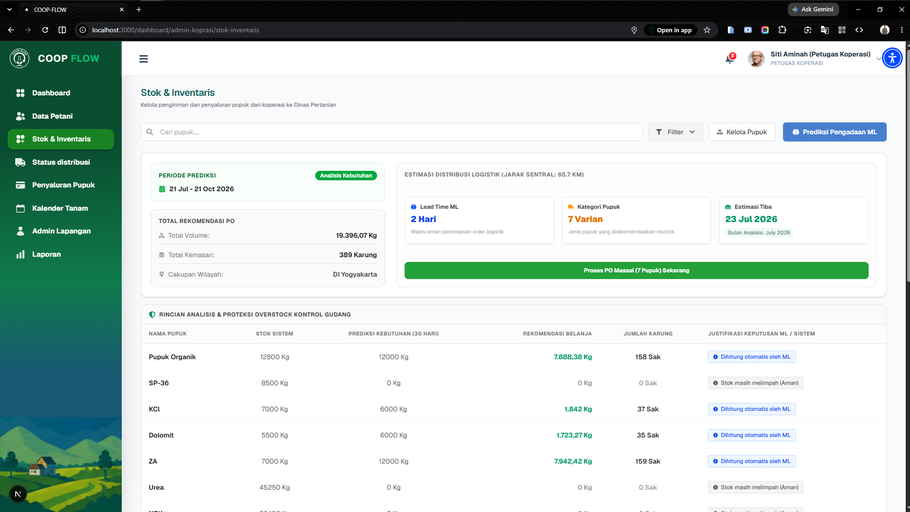
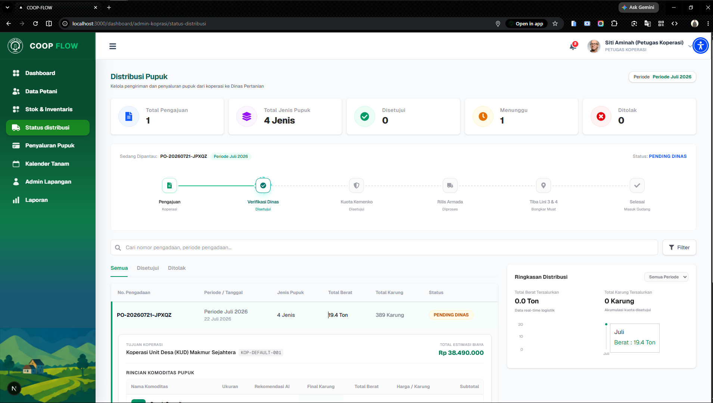
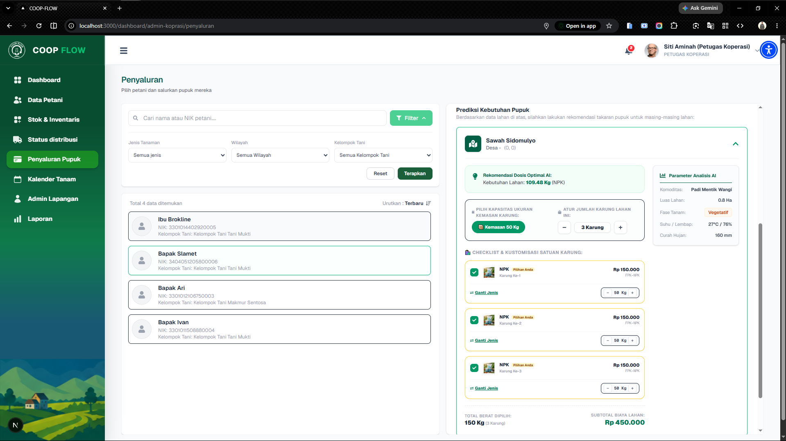

# COOP-FLOW — Platform Manajemen & Prediksi Kebutuhan Pupuk KDKMP

**COOP-FLOW** adalah sistem terintegrasi untuk mengoptimalkan distribusi pupuk dan prediksi stok pengadaan bagi koperasi desa merah putih. Sistem ini memanfaatkan arsitektur microservices berbasis Docker yang menghubungkan **Next.js** (Frontend), **Laravel** (Backend REST API), **FastAPI** (ML Engine), serta **PostGIS** (Database Spatial).

---

## Arsitektur Sistem & Port Services

Aplikasi ini berjalan menggunakan `docker-compose` dengan port terkonfigurasi sebagai berikut:

| Service | Technology | Internal Port | Mapped Port (Host) | Deskripsi |
| :--- | :--- | :--- | :--- | :--- |
| **Frontend** | Next.js | `3000` | [http://localhost:3000](http://localhost:3000) | Antarmuka Pengguna (UI) |
| **Web Server** | Nginx | `80` | [http://localhost:8000](http://localhost:8000) | Reverse Proxy & API Gateway Backend |
| **Backend** | PHP 8.4 / Laravel | `9000` | - | Core REST API & Business Logic |
| **ML Engine** | Python / FastAPI | `8000` | [http://localhost:8080](http://localhost:8080) | Engine Prediksi Pupuk & Stok |
| **Database** | PostgreSQL + PostGIS | `5432` | `localhost:5432` | Relational & Spatial Database |

---

## Prasyarat (Prerequisites)

Pastikan sistem lokal Anda telah terinstal:
* [Docker Desktop](https://www.docker.com/products/docker-desktop/) (versi 20.10+)
* [Docker Compose](https://docs.docker.com/compose/) (v2.x+)
* [Git](https://git-scm.com/)

---

## Panduan Instalasi & Cara Menjalankan

### 1. Clone Repository & Setup Environment Variables

Clone repository proyek lalu buat file konfigurasi environment untuk **Backend (Laravel)** dan **Frontend (Next.js)**.

```bash
# Clone repository
git clone https://github.com/Putra-pkwl03/coop-flow.git

```
```bash
cd coop-flow

```

```bash
# 1. Setup Environment Backend (Laravel)
cp backend/.env.example backend/.env

```

> **Catatan:** Jangan lupa untuk menyesuaikan variabel lingkungan di file `backend/.env` dengan konfigurasi database.

```bash
cat << 'EOF' > backend/.env #jangan lupa di hapus baris ini 
APP_NAME=Laravel
APP_ENV=local
APP_KEY=
APP_DEBUG=true
APP_URL=http://localhost:8000
FRONTEND_URL=http://localhost:3000
SANCTUM_STATEFUL_DOMAINS=localhost:3000

APP_MAINTENANCE_DRIVER=file
BCRYPT_ROUNDS=12

LOG_CHANNEL=stack
LOG_STACK=single
LOG_DEPRECATIONS_CHANNEL=null
LOG_LEVEL=debug

DB_CONNECTION=pgsql
DB_HOST=database
DB_PORT=5432
DB_DATABASE=coopflow_db
DB_USERNAME=coopflow_user
DB_PASSWORD=secretpassword

# FastAPI Predictive Engine Configuration
FASTAPI_BASE_URL=http://ml-engine:8000
FASTAPI_TIMEOUT=30
EOF #jangan lupa di hapus baris ini

```

# 2. Setup Environment Frontend Next.js. buat file manual seperti biasa dengan nama .env.local
```bash
cat << 'EOF' > frontend/.env.local #jangan lupa di hapus baris ini
NEXT_PUBLIC_API_URL=[http://127.0.0.1:8000](http://127.0.0.1:8000)
NEXT_PUBLIC_WEATHER_API_KEY=580138b622128076fd1b6a3651c6a59d
EOF #jangan lupa di hapus baris ini

```
### 3. Build & Jalankan Docker Container

Jalankan perintah berikut di direktori utama proyek:

```bash
docker compose up -d --build

```

> *Tunggu beberapa saat hingga seluruh container ter-build dan berstatus `running`.*

### 3. Install Dependency Laravel (Composer)

Jalankan pendaftaran/install ulang dependency PHP di dalam container backend:

```bash
docker compose exec backend composer install

```

### 4. Generate Application Key (Laravel)

```bash
docker compose exec backend php artisan key:generate

```

### 5. Jalankan Migrasi Database & Seeder Data

Jalankan migrasi PostGIS beserta seeder bawaan (`RoleAndUserSeeder`, `FarmerSeeder`, dll):

```bash
docker compose exec backend php artisan migrate:fresh --seed

```

---

## Akun Demo Siap Pakai (Seeder Credentials)

Setiap akun pengguna berikut disiapkan dengan **Password:** `password123`

| Role | Nama User | Email | Keterangan |
| --- | --- | --- | --- |
| **Admin Lapangan** | Budi Setiawan | `admin.lapangan@coopflow.id` | Terikat pada KUD Makmur Sejahtera |
| **Petugas Koperasi** | Siti Aminah | `koperasi@coopflow.id` | Terikat pada KUD Makmur Sejahtera |
| **Dinas Pertanian** | Ir. Ahmad Subarjo | `dinas.pertanian@go.id` | Wilayah Sleman, DIY |
| **Kemenko Pangan** | Dr. Hendra Wijaya | `kemenko.pangan@go.id` | Tingkat Pusat |
| **Petani (Tumpang Sari)** | Bapak Fikri | `fikri@email.com` | Memiliki 2 Lahan (Padi, Jagung, Singkong) |
| **Petani (Hortikultura)** | Ibu Febiyanti | `febiyanti@email.com` | Memiliki 2 Lahan (Bawang & Cabai Rawit) |
| **Petani (Padi)** | Bapak Ari | `ari@email.com` | Kelompok Tani Makmur Sentosa |
| **Petani (Jagung)** | Bapak Ivan | `ivan@email.com` | Kelompok Tani Tani Mukti |
| **Petani (Organik)** | Ibu Brokline | `brokline@email.com` | Kelompok Tani Tani Mukti |
| **Petani (Sleman Testing)** | Bapak Slamet | `slamet@email.com` | Pengujian filter Dinas Pertanian |

---

## Halaman Login 


## Halaman Dashboard Koperasi


## Halaman Predksi


## Halaman Distribusi


## Halaman Penyaluran pupuk


## Cara Menjalankan Automated Testing

### 1. Unit & Integration Testing (ML Engine)

Untuk memastikan model Machine Learning dan API FastAPI berjalan tanpa error:

```bash
docker compose exec ml-engine pytest -v

```

### 2. Backend Unit Testing (Laravel)

Untuk menguji seluruh endpoint API Laravel:

```bash
docker compose exec backend php artisan test

```

---

## 🛠️ Troubleshooting & Perintah Berguna

### 1. Melihat Log Service secara Real-Time

```bash
# Melihat log semua service
docker compose logs -f

# Melihat log ML Engine saja
docker compose logs -f ml-engine

# Melihat log Backend saja
docker compose logs -f backend

# Melihat log Frontend saja
docker compose logs -f frontend

---

## Dokumentasi API Swagger


